## Content Table

- [Labo 1](#labo-1)
  - [Config VM](#config-vm)
  - [Config Windows](#config-windows)
  - [Install IIS 10](#install-iis-10)
  - [Config IIS 10](#config-iis-10)
  - [Install PHP](#install-php)
  - [Add Auth](#add-auth)
  - [FTP](#ftp)
  - [Backup](#backup)
- [Labo 2](#labo-2)
  - [Exe 1](#exe-1)
  - [Exe 2](#exe-2)
  - [Exe 3](#exe-3)
  - [Exe 4](#exe-4)
- [Labo 3](#labo-3)
  - [Add new site](#add-new-site)
    - [Test site](#test-site)
  - [Config rules](#config-rules)
    - [Test site](#test-site-1)
  - [Config Auth](#config-auth)
    - [Test](#test)
- [Lab 4](#lab-4)

# Labo 1

## Config VM

Operating system : `Windows Server 2016`  
Virtual machine name : `SRW3`  
Live other param by default  
In customize hardware, remove **sound card** and **printer**

## Config Windows

System : `Windows Server 2016 V1607 (OS Build 14393.447)`  
Langage : `english-US`  
Time format : `US`  
Keyboard : `Swiss French`  
Windows Key :  `WC2BQ-8NRM3-FDDYY-2BFGV-KHKQY`  
System : `Windows server 2016 (Desktop Experience)`  
Installation : `Custom`

## Install IIS 10

On dashboard, choose **Add roles and features**  
Select server roles `Web Server (IIS)`  
No change in Features  
On Role Services, choose in Application Developement :  
  
Finish installation  

## Config IIS 10

Go on **Internet Information Services (IIS) Manager**  
  

Disabled default site : **WIN-XXX...** -> **Sites** -> **Default Web Site** -> right clic -> **Manage** -> **Stop**  

Add new site : **WIN-XXX...** -> **Sites** -> right clic -> **Add Website**

Fill like this :  
  

Clic on the new site **Site IIS** -> **Default Document** and add new default document `iis.html`  

Next go on **C:\iis_www** and add new file `iis.html` and paste `"MON Site IIS"` into  

Add new **Inbound Rules** in firewall to **Port** `8080`

## Install PHP

Create folder `PHP7.4.2` in **C:\\**  

Go on https://windows.php.net/download/ and download PHP 7.4.2 in zip format  
Extract content of zip in **C:\PHP7.4.2\\** folder  

Go on https://aka.ms/vs/16/release/vc_redist.x64.exe and execute the exe file  

Next go back on **Internet Information Services (IIS) Manager** -> **WIN-XXX...** and choose **Handler Mappings**  
Add new mapping  
  
Fill content with the same configuration  
  

Restart site : **WIN-XXX...** -> **Sites** -> **Site IIS** -> right clic -> **Manage** -> **Restart**  

Next go on **C:\iis_www** and add new file `index.php` and paste `<?php phpinfo() ?>` into  

## Add Auth

Install Server Roles `Active Directory Domain Services`  
Show warning message et clic on `Promote this ...`  
  
Add a new forest `srw3.local`  
Check form is same (you choose password) :  
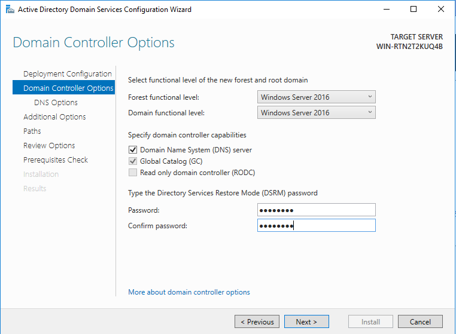  
After just go of end of config and finish installation  

Add `Windows Authentification` on **Manage** -> **Add Roles and Features**  
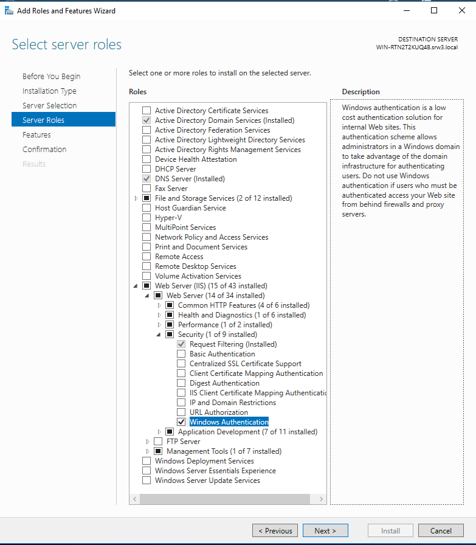  

Next Go on **Internet Information Services (IIS) Manager** -> **WIN-XXXX...** and select **Authentification** on IIS  
Disabled all and Enable **Windows Authentification**

## FTP

First, install Server Roles `FTP`  


On confirmation page, active `Restart the dest...` and finish installation  

Reload **Internet Information Services (IIS) Manager** and add FTP site :  
  

Field form with `FTP IIS` for the name and site folder `C:\iis_www` for physical path  

Check you are the same information :  

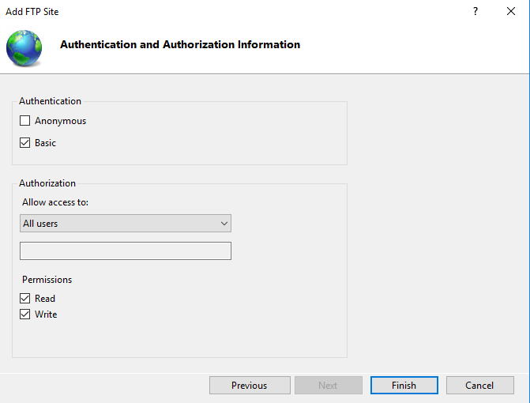

Apply change and restart **FTPSVC Services** on Task Manager  
  

## Backup

Add new feature `Windows Server Backup`  
  
On confirmation page, active `Restart the dest...` and finish installation  

Next shut down the VM and add new disk with 1GB 

Restart VM and open **Disk Management** console  

Set the new disk on Online and Initialize it  

 

Create simple partition   
  
with max size, use `B` for drive letter, named volume `Backup` and finish configuration  

Go on **Windows Server Backup** console and clic on **Backup Shedule...** :
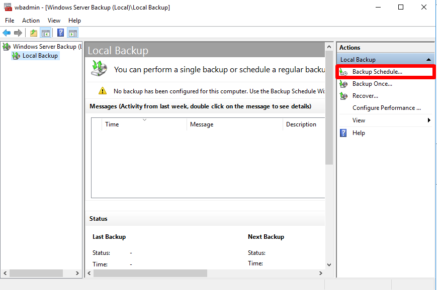  

On **Select Backup Config...** choose `Custom`  
On **Select Items for Backup** add `"C:\iis_www\` et `C:\Windows\System32\inetsrv\config\` :  
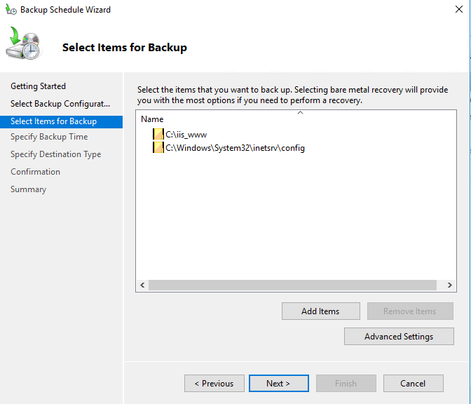  

Backup up to a volume and select `Backup (B:)`  
Check you have the same informations :  
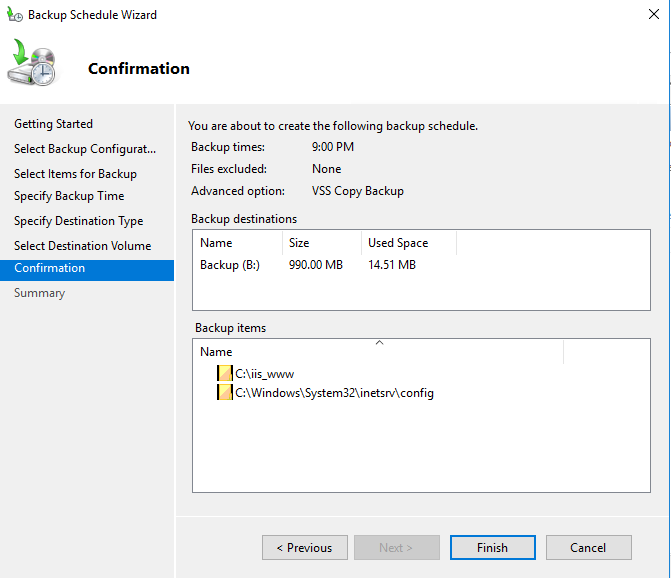  
Finish configuration

[Content Table](##-Content-Table)

# Labo 2

Before start, disabled all active sites in **Internet Information Services (IIS) Manager** -> **WIN-XXX...** -> **Sites**

## Exe 1

Run this in **cmd** :  

    md C:\SRW\Site01\ C:\SRW\repvirtuel\ && echo "indexsite01" > C:\SRW\Site01\indexsite01.html && echo "indexvirtuel" > C:\SRW\repvirtuel\indexvirtuel.html

On **Internet Information Services (IIS) Manager** -> **WIN-XXX...** -> **Sites** -> right click -> **Add Website...**, fill with the same config :  
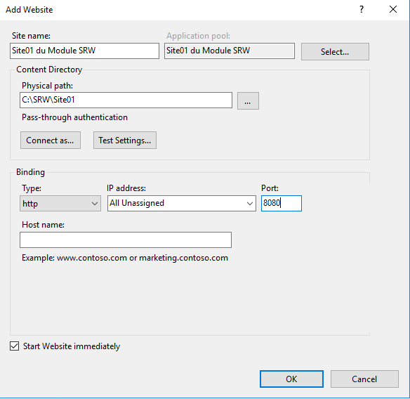  

Choose **Site01 ...** and open **Advanced Settings...** and change **ID** by `31` and close
Open **Default Document** and remove all
Add default document `indexsite01.html`

Next go on **Directory Browsing** and enable  
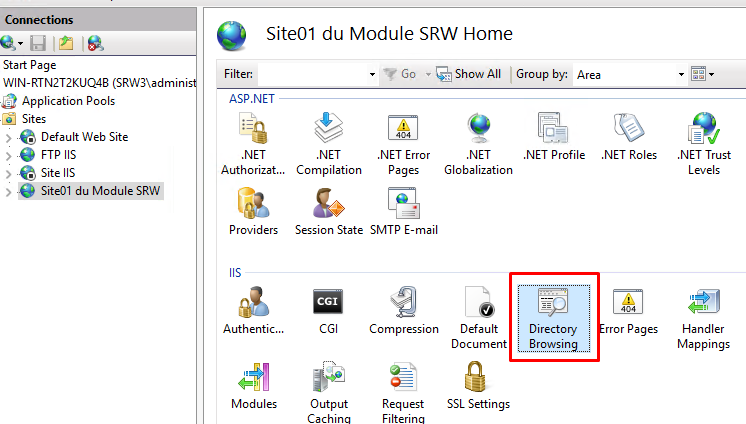  
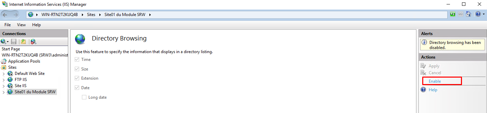  

Right click on site and choose **Add Virutal Directory...**  
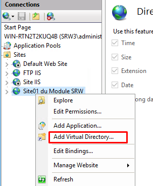  
And fill like this :  
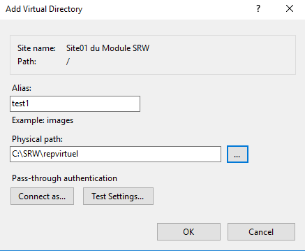  

## Exe 2

Run this in **cmd** on admin mode :  

    md C:\SRW\Site02\ && echo "indexsite02" > C:\SRW\Site02\indexsite02.html

    cd C:\Windows\System32\inetsrv  

    appcmd add site /name:"Site02 du Module SRW" /id:32 /physicalPath:C:\SRW\Site02 /bindings:http/*:8888:

    appcmd set config "Site02 du Module SRW" /section:defaultDocument /~files"

    appcmd set config "Site02 du Module SRW" /section:defaultDocument /+files.[value='indexsite02.html']

    appcmd set config "Site02 du module SRW" /section:directoryBrowse /enabled:true
    
    appcmd add vdir /app.name:"Site02 du Module SRW/" /path:/test2 /physicalPath:C:\SRW\repvirtuel

    netsh advfirewall firewall add rule name="Port 8888" protocol=TCP dir=in localport=8888 action=allow

## Exe 3

Run this in **cmd** :

    md C:\SRW\Site03\ && echo "indexsite03" > C:\SRW\Site03\indexsite03.html && echo "" > C:\SRW\Site03\web.config

Next open **C:\Windows\System32\inetsrv\config\application\Host config** and add between <sites>...</sites> :

    ```xml
    <site name="Site03 du Module SRW" id="33" serverAutoStart="true">
        <application path="/">
            <virtualDirectory path="/" physicalPath="C:\SRW\Site03" />
            <virtualDirectory path="/test3" physicalPath="C:\SRW\repvirtuel" />
        </application>
        <bindings>
            <binding protocol="http" bindingInformation="*:8880:" />
        </bindings>
    </site>
    ```
Save and quit file

Open **C:\SRW\Site03\web.config** and paste :  

    ```xml
    <site name="Site03 du Module SRW" id="33" serverAutoStart="true">
        <application path="/">
            <virtualDirectory path="/" physicalPath="C:\SRW\Site03" />
            <virtualDirectory path="/test3" physicalPath="C:\SRW\repvirtuel" />
        </application>
        <bindings>
            <binding protocol="http" bindingInformation="*:8880:" />
        </bindings>
    </site>
    ```
Save and quit

Run this in **cmd** on admin mode :  

    netsh advfirewall firewall add rule name="Port 8880" protocol=TCP dir=in localport=8880 action=allow

## Exe 4

Show available sites :  

    appcmd list sites

Show sites with port **8080** :  

    appcmd list sites /bindings:http/*:8080:

Stop site with port **8080** :

    appcmd list site /bindings:http/*:8080: /xml | appcmd stop site /in

Start site with port **8080** :

    appcmd list site /bindings:http/*:8080: /xml | appcmd start site /in

Remove virtual repository **test1** from **site01** :

    appcmd delete vdir /vdir.name:"Site01 du module SRW/test1"

Backup IIS config :  

    appcmd add backup monbackup

Remove site **Site01** :  

    appcmd delete site "Site02 du module SRW"

Restore preview backup on IIS config :  

    appcmd restore backup monbackup

[Content Table](##-Content-Table)

# Labo 3

## Add new site

Run in **cmd**:  

    md C:\SRW\labo\ C:\SRW\labo\Private\ C:\SRW\labo\Public\ && echo "labo" > C:\SRW\labo\labo.html && echo "private" > C:\SRW\labo\Private\private.html && echo "public" > C:\SRW\labo\Public\public.html

    cd C:\Windows\System32\inetsrv  
    
    appcmd list site /xml /state:"$=started" | appcmd stop site /in  

    appcmd add site /name:"labo du Module SRW" /id:41 /physicalPath:C:\SRW\labo /bindings:http/*:80:  

    appcmd set config "labo du Module SRW" /section:defaultDocument /~files"  
    appcmd set config "labo du Module SRW" /section:defaultDocument /+files.[value='labo.html']  

    appcmd set config "labo du Module SRW/Private" /section:defaultDocument /~files"  
    appcmd set config "labo du Module SRW/Private" /section:defaultDocument /+files.[value='private.html']  

    appcmd set config "labo du Module SRW/Public" /section:defaultDocument /~files"  
    appcmd set config "labo du Module SRW/Public" /section:defaultDocument /+files.[value='public.html']  

    appcmd set config "labo du Module SRW" /section:directoryBrowse /enabled:true  

### Test site

Test access (where IP is Server address):

    http://192.168.119.141 => access granted
    http://192.168.119.141/public => access granted
    http://192.168.119.141/private => access granted

## Config rules

Open **Server Manager** console and choose **Add Roles and Features**  

Go to **Server Roles** -> **Web Server (IIS)** -> **Web Server** -> **Security**  

Check `IP and Domain Restrictions` and finish installation  

Next open **Internet Information Services (IIS) Manager**  

Select **labo du Module SRW** and open **IP Address and Domaine Restrictions**  
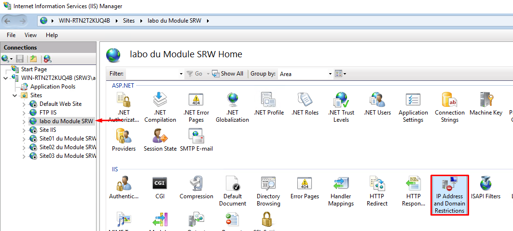  

Choose **Add Deny Entry...** and write IP of WMvare Network adapter (192.168.119.1 for me)

### Test site

Test access (where IP is Server address):

    http://192.168.119.141 => access denied
    http://192.168.119.141/public => access denied
    http://192.168.119.141/private => access denied

## Config Auth

Remove deny IP previously added

Open **Active Directory Users and Computers**  
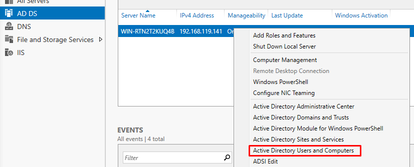  

Add new User in **srw3** forest  
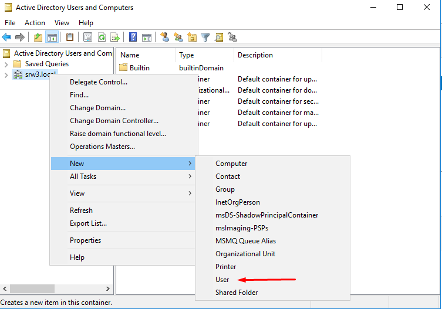  

Fill like this  
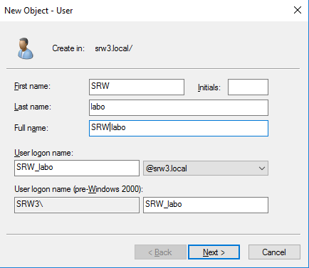  
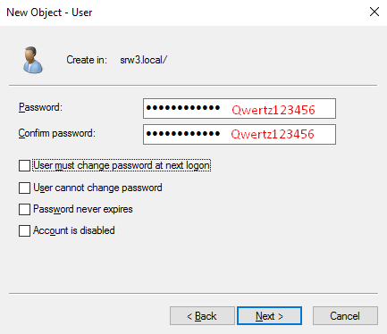  

Repeat with another new user named `SRW_private` with password `Qwertz123456`

Go on **Internet Information Services (IIS) Manager** -> **WIN-XXX...** -> **Sites** -> **labo du Module SRW** -> **Authentification**  

Enable and edit **Anonymous Authentification** and set the new user `SRW_labo` to the specic user

On **Server Management**, add new roles `Digest Authentification` an `URL Authorization`
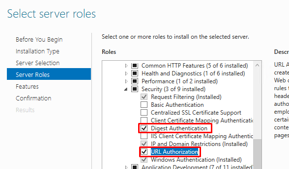  

Open site **labo du Module SRW**, select **Private** and choose **Authentification**

Enable `Disgest Authentification` and `Windows Authentification`, disable others

Edit `Disgest Authentification` and add `srw3.local`

Open **Authorization Rules** and edit the rule

Change To specific users `SRW_private`

Restart site **labo du Module SRW**

### Test

Test access (where IP is Server address):

    http://192.168.119.141 => access granted
    http://192.168.119.141/public => access granted
    http://192.168.119.141/private => authentification required, granted with SRW_private user

[Content Table](##-Content-Table)

# Lab 4

Stop the machine and edit th config

Check the **Network adapter** is : `NAT`  
Add new network adapter **Network adapter 2** and define it : `Bridged`  

Start server

Open cmd, run `ipconfig` and check ip address :  
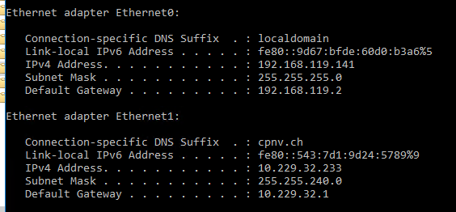  

Change adapter settings to fixed config


Open **Active Directory User and Computer** -> **srw3.local** -> **Users**  
Add 4 groups : `grpDirecteurs`, `grpIngenieurs`, `grpComptables`, `grpClients`  
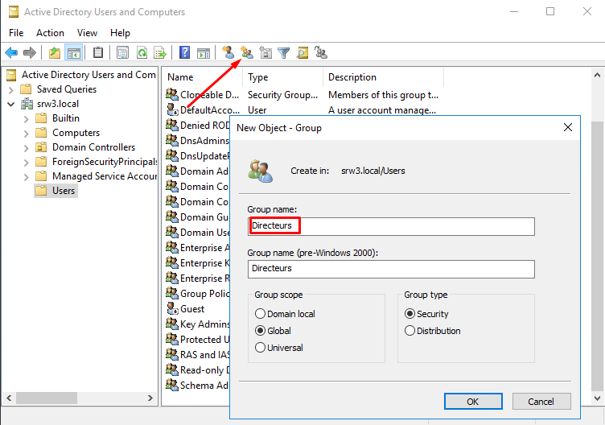  

Add 6 users with informations : (disabled `User must change password ...`)  
| Firstname | Lastname| Login   | Password     |
|-----------|---------|---------|--------------|
| DUPONT    | Marcel  | mdupont | Qwertz123456 |
| BRICOT    | Juda    | jbricot | Asdfgh123456 |
| ASSAIN    | Marc    | massain | Yxcvbn123456 |
| DEUF      | John    | jdeuf   | Qaywsx123456 |
| DIOCY     | Kelly   | kdiocy  | Edcrfv123456 |
| Clients   |         | dclient | Tgbzhn123456 |

Next add users in group :  
**DUPONT Marcel** -> `grpDirecteurs`  
**BRICOT Juda** -> `grpIngénieurs`  
**ASSAIN Marc** -> `grpComptables`  
**DEUF John** -> `grpIngénieurs`  
**DIOCY Kelly** -> `grpIngénieurs`  
**Clients** -> `grpClients`  
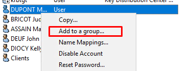  

Open CMD and run :

    md C:\www C:\www\Internet\ C:\www\Internet\dclient\ C:\www\Intranet\ C:\www\Intranet\Users\ C:\www\Intranet\Users\mdupont\ C:\www\Intranet\Users\jbricot\ C:\www\Intranet\Users\massain\ C:\www\Intranet\Users\jdeuf\ C:\www\Intranet\Users\kdiocy\
    
    echo Internet > C:\www\Internet\index.html && echo dclient > C:\www\Internet\dclient\index.html && echo Intranet > C:\www\Intranet\index.html && echo mdupont > C:\www\Intranet\Users\mdupont\index.html && echo jbricot > C:\www\Intranet\Users\jbricot\index.html && echo massain > C:\www\Intranet\Users\massain\index.html && echo jdeuf > C:\www\Intranet\Users\jdeuf\index.html && echo kdiocy > C:\www\Intranet\Users\kdiocy\index.html

Go to **Internet Information Services (IIS) Manager** -> **WIN-XXX...** -> **Sites**  

Stop all sites  

Add new website :  
Site name : `Internet`  
Physical path : `C:\www\Internet`  
Ip address : `10.229.xx.xx`  
Port: `80`

Add new website :  
Site name : `Intranet`  
Physical path : `C:\www\Intranet`  
Ip address : `192.168.xx.xx`  
Port: `80`

On **Internet** :  
**Authentication** : `Anonymous Authentication` -> `Enabled`  
**Default Document** : Remove all except `index.html`  
Folder **dclient** :
    **Authentication** -> enabled `Windows Authentication` and disabled others
    **Authorization Rules** -> Remove `All Users` and add groups `grpIngénieur` and `grpClients`
Add virtual directory :  
**Alias** : `Intranet`
**Physical path** : `C:\www\Intranet`

On **intranet** :
**Authentication** : enabled `Windows Authentication` and disabled others
**Default Document** : Remove all except `index.html` 
Folder **Users** :
    **Authentication** -> enabled `Windows Authentication` and disabled others
    For each folder in **User**, set **Authorization Rules** -> Remove `All Users` and add user with the same name of folder
        Exemple : Folder **jbricot** : "Authorization Rules" -> Remove `All Users` and add `jbricot`
Add virtual directory :  
**Alias** : `Internet`
**Physical path** : `C:\www\Internet`

Go on **Internet Information Services (IIS) Manager** -> **WIN-XXX...**
Open **Server Certificates** 
Choose on the right **Create Self-Signed Certificate...** :
Name : `SRW3`
Certificate store : `Web Hosting`

Next add biding https on **Internet** and **Intranet** :
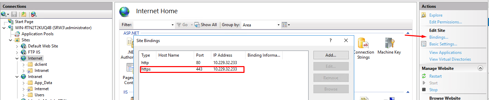  
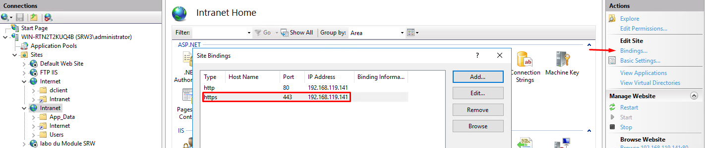  
