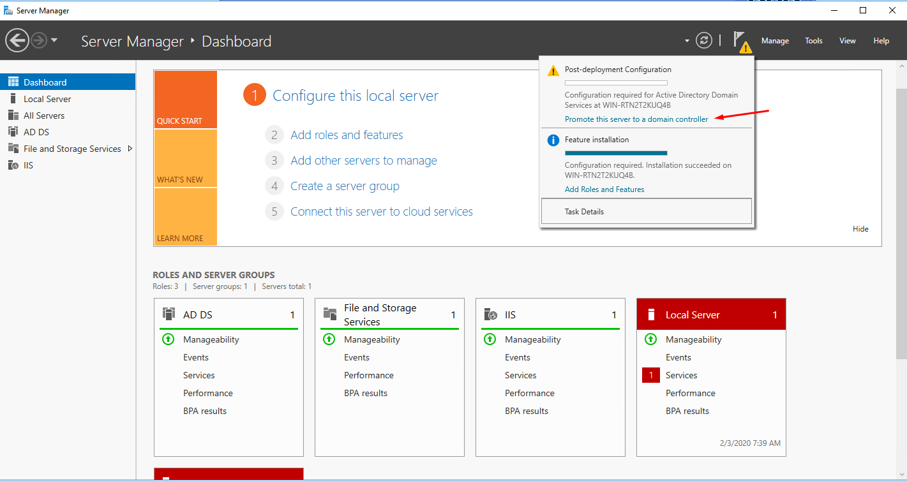
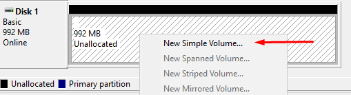

## Table des matières

- [Table des matières](#table-des-mati%c3%a8res)
- [Config VM](#config-vm)
- [Config Windows](#config-windows)
- [Install IIS 10](#install-iis-10)
- [Config IIS 10](#config-iis-10)
- [Install PHP](#install-php)
- [Add Auth](#add-auth)
- [FTP](#ftp)
- [Backup](#backup)

## Config VM

Operating system : `Windows Server 2016`  
Virtual machine name : `SRW3`  
Live other param by default  
In customize hardware, remove **sound card** and **printer**

## Config Windows

System : `Windows Server 2016 V1607 (OS Build 14393.447)`  
Langage : `english-US`  
Time format : `US`  
Keyboard : `Swiss French`  
Windows Key :  `WC2BQ-8NRM3-FDDYY-2BFGV-KHKQY`  
System : `Windows server 2016 (Desktop Experience)`  
Installation : `Custom`

## Install IIS 10

On dashboard, choose **Add roles and features**  
Select server roles `Web Server (IIS)`  
No change Features  
On Role Services, choose in Application Developement :  
  
Finish installation  

## Config IIS 10

Go on **Internet Information Services (IIS) Manager**  
  
Disabled default site : **WIN-XXX...** -> **Sites** -> **Default Web Site** -> right clic -> **Manage** -> **Stop**  
Add new site : **WIN-XXX...** -> **Sites** -> right clic -> **Add Website**
Fill like this :
  
Clic on the new site **Site IIS** -> **Default Document** and add new default document `iis.html`  
Next go on **C:\iis_www** and add new file `iis.html` and paste `"MON Site IIS"` into  

## Install PHP

Create folder `PHP7.4.2` in **C:\\**  
Go on https://windows.php.net/download/ and download PHP 7.4.2 in zip format  
Extract content of zip in **C:\PHP7.4.2\\** folder  
Go on https://aka.ms/vs/16/release/vc_redist.x64.exe and execute the exe file  
Next go back on Internet Information Services (IIS) Manager -> **WIN-XXX...** and choose **Handler Mappings**  
Add new mapping  
  
Fill content with the same configuration  
  
Restart site : **WIN-XXX...** -> **Sites** -> **Site IIS** -> right clic -> **Manage** -> **Restart**  
Next go on **C:\iis_www** and add new file `index.php` and paste `<?php phpinfo() ?>` into  

## Add Auth

Define static ip adress  
Install Server Roles `Active Directory Domain Services`  
Show warning message et clic on `Promote this ...`  

Add a new forest `srw3.local`  
Check form is same (you choose password) :  

After just go of end of config and finish installation  
Add `Windows Authentification` on **Manage** -> **Add Roles and Features**  

Next Go on Internet Information Services (IIS) Manager -> **WIN-XXXX...** and select **Authentification** on IIS  
Disabled all and Enable **Windows Authentification**

## FTP

First, install Server Roles `FTP`  

On confirmation page, active `Restart the dest...` and finish installation  
Reload **Internet Information Services (IIS) Manager** and add FTP site :  
  
Field form with `FTP IIS` for the name and site folder `C:\iis_www` for physical path  
Check you are the same information :  

Now go on **Internet Information Services (IIS) Manager** -> **FTP** -> **FTP Firewall Support**  
Set Data Channel Port Range by : `9990-10000` 
Apply change and restart **FTPSVC Services** on Task Manager  
  

## Backup

Add new feature `Windows Server Backup`  
  
On confirmation page, active `Restart the dest...` and finish installation  
Next shut down the VM and add new disk with 1GB  
Restart VM and open Disk Management console  
Set the new disk on Online and Initialize it  

  
Create simple partition   
  
with max size, use **B** for drive letter, named volume **Backup** and finish configuration  

Go on Windows Server Backup console  